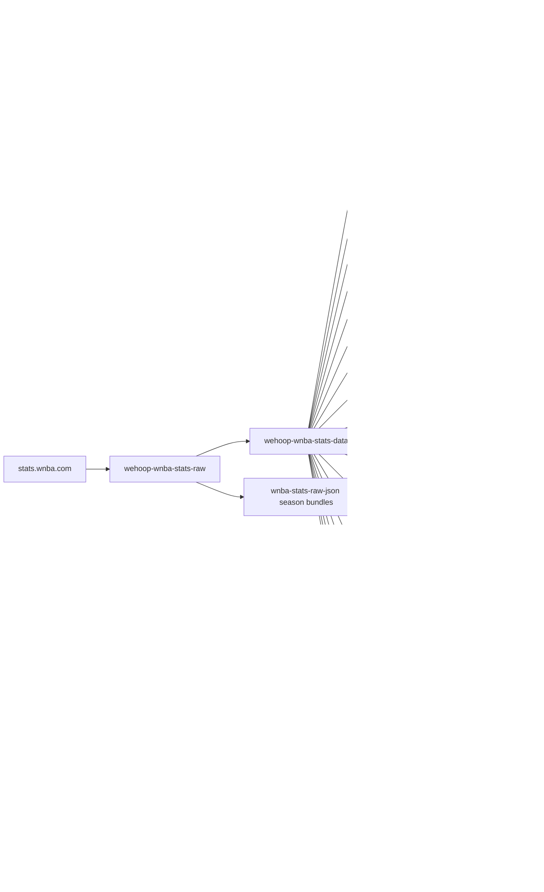
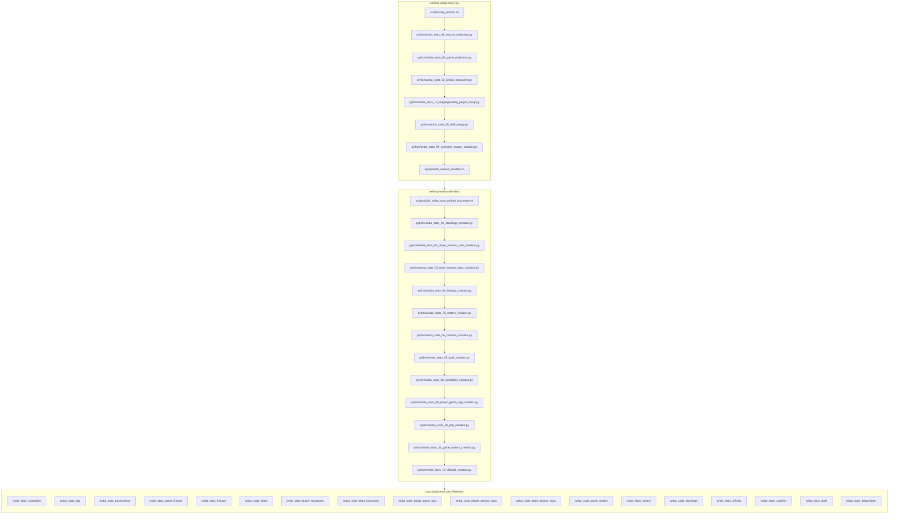

# wehoop-wnba-stats-data


## wehoop WNBA Stats workflow diagram





`scripts/daily_refresh.sh` (raw) and `scripts/daily_wnba_stats_python_processor.sh`
(data) are the drivers; the raw side also publishes whole-season JSON bundles to
its own `wnba-stats-raw-json` release. Stage numbers are intended build order,
not run order.

[wehoop-wbb-raw repository (source: ESPN)](https://github.com/sportsdataverse/wehoop-wbb-raw)

[wehoop-wbb-data repository (source: ESPN)](https://github.com/sportsdataverse/wehoop-wbb-data)

[wehoop-wnba-raw repository (source: ESPN)](https://github.com/sportsdataverse/wehoop-wnba-raw)

[wehoop-wnba-data repository (source: ESPN)](https://github.com/sportsdataverse/wehoop-wnba-data)

[wehoop-wnba-stats-raw repository (source: WNBA Stats)](https://github.com/sportsdataverse/wehoop-wnba-stats-raw)

[wehoop-wnba-stats-data repository (source: WNBA Stats)](https://github.com/sportsdataverse/wehoop-wnba-stats-data)

[ncaa-wbb-hoops-raw repository (source: stats.ncaa.org)](https://github.com/sportsdataverse/ncaa-wbb-hoops-raw)

[ncaa-wbb-hoops-data repository (source: stats.ncaa.org)](https://github.com/sportsdataverse/ncaa-wbb-hoops-data)

## Women's Basketball Data Releases

[ESPN Women's College Basketball Schedules](https://github.com/sportsdataverse/sportsdataverse-data/releases/tag/espn_womens_college_basketball_schedules)

[ESPN Women's College Basketball PBP](https://github.com/sportsdataverse/sportsdataverse-data/releases/tag/espn_womens_college_basketball_pbp)

[ESPN Women's College Basketball Team Boxscores](https://github.com/sportsdataverse/sportsdataverse-data/releases/tag/espn_womens_college_basketball_team_boxscores)

[ESPN Women's College Basketball Player Boxscores](https://github.com/sportsdataverse/sportsdataverse-data/releases/tag/espn_womens_college_basketball_player_boxscores)

[ESPN WNBA Schedules](https://github.com/sportsdataverse/sportsdataverse-data/releases/tag/espn_wnba_schedules)

[ESPN WNBA PBP](https://github.com/sportsdataverse/sportsdataverse-data/releases/tag/espn_wnba_pbp)

[ESPN WNBA Team Boxscores](https://github.com/sportsdataverse/sportsdataverse-data/releases/tag/espn_wnba_team_boxscores)

[ESPN WNBA Player Boxscores](https://github.com/sportsdataverse/sportsdataverse-data/releases/tag/espn_wnba_player_boxscores)


## Data Repositories

[wehoop-wnba-raw data repository (source: ESPN)](https://github.com/sportsdataverse/wehoop-wnba-raw)

[wehoop-wnba-data repository (source: ESPN)](https://github.com/sportsdataverse/wehoop-wnba-data)

[wehoop-wnba-stats-data Repo (source: NBA Stats)](https://github.com/sportsdataverse/wehoop-wnba-stats-data)

[wehoop-wbb-raw data repository (source: ESPN)](https://github.com/sportsdataverse/wehoop-wbb-raw)

[wehoop-wbb-data repository (source: ESPN)](https://github.com/sportsdataverse/wehoop-wbb-data)


## Automation

This repo is refreshed by the `Update WNBA Stats Data` GitHub Actions workflow
(`.github/workflows/daily_wnba_stats.yml`), which calls
`scripts/daily_wnba_stats_R_processor.sh` to invoke the R generation scripts
under `R/`.

### Cron schedule (UTC)

`daily_wnba_stats.yml` runs once a day at **07:00 UTC**. Two cron entries cover
the WNBA calendar:

- `0 7 * 5-9 *` — daily, May through September (preseason through playoffs).
- `0 7 1-20 10 *` — daily, October 1 through 20 (playoffs tail).

`annual_wnba_stats_draft.yml` runs twice at 08:00 UTC, on April 15 and 16 — the
second pass catches picks entered late on draft night.

**Known contention:** the parallel ESPN workflow in `wehoop-wnba-data` also fires
at 07:00 UTC, so the two jobs currently share the proxy pool rather than being
offset. That repo's windows (Oct-Jul) also track the NBA calendar rather than the
WNBA one. Neither is fixed here; both are worth a look.

### Triggers

- `repository_dispatch` event type: **`daily_wnba_stats_data`**.
- Manual run via the GitHub UI (Actions tab -> *Update WNBA Stats Data* ->
  *Run workflow*) or from the CLI:

  ```sh
  gh workflow run daily_wnba_stats.yml -f start_year=2024 -f end_year=2024
  ```

  When `start_year` / `end_year` are omitted the workflow defaults both to
  `wehoop::most_recent_wnba_season()`.

### Proxy list

The R generation scripts read a proxy list from `../../proxylist.csv` (relative
to the repository checkout). The workflow writes that file at job start from
the `WNBA_STATS_PROXY_LIST` GitHub Actions secret (CSV body with columns
`ip,port,login,password`). Set the secret on the repo to enable proxied calls
to the WNBA Stats API.

## Repository layout

<!-- BEGIN GENERATED: layout -->

```
wehoop-wnba-stats-data/
├── R/   # R pipeline stages and publish toolchain
│   ├── manifest_upload_helper.R
│   ├── minify_json_folders.R
│   └── utils.R
├── build_out/
│   ├── wnba_stats_draft/
│   ├── wnba_stats_pbp/
│   ├── wnba_stats_player_boxscores/
│   ├── wnba_stats_schedules/
│   └── wnba_stats_team_boxscores/
├── docs/   # explainers, model reports and dataset docs
│   ├── datasets/
│   └── models/
├── logs/   # per-run logs (gitignored where large)
├── models/   # model artifacts, cards and the registry
├── ops/   # cron definitions and runbooks
│   ├── init/
│   └── oneoff/
├── python/   # Python pipeline stages, numbered in build order
│   ├── build_out/
│   ├── wehoop_wnba_stats_data_build.egg-info/
│   ├── wnba_data_build/
│   ├── wnba_model_publish/
│   ├── wnba_model_01_possessions.py
│   ├── wnba_model_02_rapm.py
│   ├── wnba_model_03_spm.py
│   ├── wnba_model_04_adj_rapm.py
│   ├── wnba_model_05_bpm.py
│   ├── wnba_model_06_war.py
│   ├── wnba_model_07_darko.py
│   ├── wnba_model_08_impact.py
│   ├── wnba_stats_01_standings_creation.py
│   ├── wnba_stats_02_player_season_stats_creation.py
│   ├── wnba_stats_03_team_season_stats_creation.py
│   ├── wnba_stats_04_lineups_creation.py
│   └── … 12 more
├── scripts/   # bash drivers (the daily/weekly entry points)
│   ├── backfill_historical_seasons.sh
│   ├── daily_wnba_stats_python_processor.sh
│   ├── leaguedash_backfill.sh
│   ├── render_model_docs.sh
│   ├── run_v3_backfill.sh
│   ├── run_v3_cutover.sh
│   └── wnba_models.sh
├── tests/   # test suite
│   ├── fixtures/
│   ├── test_build.py
│   ├── test_cli.py
│   ├── test_docs.py
│   ├── test_from_raw.py
│   ├── test_from_raw_offline.py
│   ├── test_impact_stages.py
│   ├── test_manifest.py
│   ├── test_model_manifest.py
│   ├── test_model_matches_loader_schema.py
│   ├── test_model_publish_cli.py
│   ├── test_model_registry.py
│   ├── test_models.py
│   ├── test_partial_guard.py
│   ├── test_publish.py
│   ├── test_raw.py
│   └── … 7 more
├── v3_staging/
│   └── _release_build/
└── wnba_stats/
    ├── coaches/
    ├── draft/
    ├── game_rosters/
    ├── lineups/
    ├── officials/
    ├── pbp/
    ├── player_boxscores/
    ├── player_game_logs/
    └── … 7 more
```

<!-- END GENERATED: layout -->

## Datasets

<!-- BEGIN GENERATED: datasets -->
| Script | Dataset | Release tag | Last published |
|---|---|---|---|
| [`python/wnba_stats_01_standings_creation.py`](python/wnba_stats_01_standings_creation.py) | [`standings`](docs/datasets/standings.md) | [`wnba_stats_standings`](https://github.com/sportsdataverse/sportsdataverse-data/releases/tag/wnba_stats_standings) | 2026-07-29 |
| [`python/wnba_stats_02_player_season_stats_creation.py`](python/wnba_stats_02_player_season_stats_creation.py) | [`player_season_stats`](docs/datasets/player_season_stats.md) | [`wnba_stats_player_season_stats`](https://github.com/sportsdataverse/sportsdataverse-data/releases/tag/wnba_stats_player_season_stats) | 2026-07-29 |
| [`python/wnba_stats_03_team_season_stats_creation.py`](python/wnba_stats_03_team_season_stats_creation.py) | [`team_season_stats`](docs/datasets/team_season_stats.md) | [`wnba_stats_team_season_stats`](https://github.com/sportsdataverse/sportsdataverse-data/releases/tag/wnba_stats_team_season_stats) | 2026-07-29 |
| [`python/wnba_stats_04_lineups_creation.py`](python/wnba_stats_04_lineups_creation.py) | [`lineups`](docs/datasets/lineups.md) | [`wnba_stats_lineups`](https://github.com/sportsdataverse/sportsdataverse-data/releases/tag/wnba_stats_lineups) | 2026-07-29 |
| [`python/wnba_stats_05_rosters_creation.py`](python/wnba_stats_05_rosters_creation.py) | [`rosters`](docs/datasets/rosters.md) | [`wnba_stats_rosters`](https://github.com/sportsdataverse/sportsdataverse-data/releases/tag/wnba_stats_rosters) | 2026-07-29 |
| [`python/wnba_stats_06_coaches_creation.py`](python/wnba_stats_06_coaches_creation.py) | [`coaches`](docs/datasets/coaches.md) | [`wnba_stats_coaches`](https://github.com/sportsdataverse/sportsdataverse-data/releases/tag/wnba_stats_coaches) | 2026-07-29 |
| [`python/wnba_stats_07_draft_creation.py`](python/wnba_stats_07_draft_creation.py) | [`draft`](docs/datasets/draft.md) | [`wnba_stats_draft`](https://github.com/sportsdataverse/sportsdataverse-data/releases/tag/wnba_stats_draft) | 2026-08-12 |
| [`python/wnba_stats_08_schedules_creation.py`](python/wnba_stats_08_schedules_creation.py) | [`schedules`](docs/datasets/schedules.md) | [`wnba_stats_schedules`](https://github.com/sportsdataverse/sportsdataverse-data/releases/tag/wnba_stats_schedules) | 2026-08-12 |
| [`python/wnba_stats_09_player_game_logs_creation.py`](python/wnba_stats_09_player_game_logs_creation.py) | [`player_game_logs`](docs/datasets/player_game_logs.md) | [`wnba_stats_player_game_logs`](https://github.com/sportsdataverse/sportsdataverse-data/releases/tag/wnba_stats_player_game_logs) | 2026-07-29 |
| [`python/wnba_stats_10_pbp_creation.py`](python/wnba_stats_10_pbp_creation.py) | [`pbp`](docs/datasets/pbp.md) | [`wnba_stats_pbp`](https://github.com/sportsdataverse/sportsdataverse-data/releases/tag/wnba_stats_pbp) | 2026-08-12 |
| [`python/wnba_stats_11_game_rosters_creation.py`](python/wnba_stats_11_game_rosters_creation.py) | [`game_rosters`](docs/datasets/game_rosters.md) | [`wnba_stats_game_rosters`](https://github.com/sportsdataverse/sportsdataverse-data/releases/tag/wnba_stats_game_rosters) | 2026-07-29 |
| [`python/wnba_stats_12_officials_creation.py`](python/wnba_stats_12_officials_creation.py) | [`officials`](docs/datasets/officials.md) | [`wnba_stats_officials`](https://github.com/sportsdataverse/sportsdataverse-data/releases/tag/wnba_stats_officials) | 2026-07-29 |
| [`python/wnba_stats_13_player_boxscores_creation.py`](python/wnba_stats_13_player_boxscores_creation.py) | [`player_boxscores`](docs/datasets/player_boxscores.md) | [`wnba_stats_player_boxscores`](https://github.com/sportsdataverse/sportsdataverse-data/releases/tag/wnba_stats_player_boxscores) | 2026-07-29 |
| [`python/wnba_stats_14_team_boxscores_creation.py`](python/wnba_stats_14_team_boxscores_creation.py) | [`team_boxscores`](docs/datasets/team_boxscores.md) | [`wnba_stats_team_boxscores`](https://github.com/sportsdataverse/sportsdataverse-data/releases/tag/wnba_stats_team_boxscores) | 2026-07-29 |
| [`python/wnba_stats_15_shots_creation.py`](python/wnba_stats_15_shots_creation.py) | [`shots`](docs/datasets/shots.md) | [`wnba_stats_shots`](https://github.com/sportsdataverse/sportsdataverse-data/releases/tag/wnba_stats_shots) | 2026-07-29 |
| [`python/wnba_stats_99_schedule_master_creation.py`](python/wnba_stats_99_schedule_master_creation.py) | [`schedule_master`](docs/datasets/schedule_master.md) | `wnba_stats/wnba_stats_schedule_master.parquet` (committed) | — |
| [`python/wnba_stats_99_schedule_master_creation.py`](python/wnba_stats_99_schedule_master_creation.py) | [`games_in_data_repo`](docs/datasets/games_in_data_repo.md) | `wnba_stats/wnba_stats_games_in_data_repo.parquet` (committed) | — |
<!-- END GENERATED: datasets -->

## Reports & explainers

<!-- BEGIN GENERATED: reports -->

| Report | What it is | Last updated |
|---|---|---|
| [Model registry](models/REGISTRY.md) | model | artifact | gates | retrain, one row per published model | 2026-09-01 |
| [Model reports & cards](docs/models/) | 1 files, one per item | 2026-09-01 |
| [Dataset docs (column-level, generated)](docs/datasets/) | 17 files, one per item | 2026-08-13 |

<!-- END GENERATED: reports -->

## Automation & status

<!-- BEGIN GENERATED: status -->

| workflow | schedule | last run |
|---|---|---|
| [](https://github.com/sportsdataverse/wehoop-wnba-stats-data/actions/workflows/annual_wnba_stats_draft.yml) | day 15 08:00 UTC in Apr; day 16 08:00 UTC in Apr | 2026-05-30 |
| [](https://github.com/sportsdataverse/wehoop-wnba-stats-data/actions/workflows/daily_wnba_stats.yml) | daily 07:00 UTC in May-Sep; days 1-20 07:00 UTC in Oct | 2026-08-27 |
| [](https://github.com/sportsdataverse/wehoop-wnba-stats-data/actions/workflows/orphan_scripts.yml) | on push / dispatch | 2026-08-27 |
| [](https://github.com/sportsdataverse/wehoop-wnba-stats-data/actions/workflows/tests.yml) | on push / PR / dispatch | 2026-08-28 |
| [](https://github.com/sportsdataverse/wehoop-wnba-stats-data/actions/workflows/wnba_models.yml) | on dispatch | never run |

| release tag | assets | size | last publish |
|---|---:|---:|---|
| [`wnba_stats_coaches`](https://github.com/sportsdataverse/sportsdataverse-data/releases/tag/wnba_stats_coaches) | 92 | 0.2 MB | 2026-08-13 |
| [`wnba_stats_draft`](https://github.com/sportsdataverse/sportsdataverse-data/releases/tag/wnba_stats_draft) | 95 | 0.3 MB | 2026-08-13 |
| [`wnba_stats_game_lineups`](https://github.com/sportsdataverse/sportsdataverse-data/releases/tag/wnba_stats_game_lineups) | 91 | 6.2 MB | 2026-08-12 |
| [`wnba_stats_game_rosters`](https://github.com/sportsdataverse/sportsdataverse-data/releases/tag/wnba_stats_game_rosters) | 95 | 0.5 MB | 2026-08-13 |
| [`wnba_stats_leaguedash`](https://github.com/sportsdataverse/sportsdataverse-data/releases/tag/wnba_stats_leaguedash) | 769 | 252.3 MB | 2026-08-13 |
| [`wnba_stats_lineups`](https://github.com/sportsdataverse/sportsdataverse-data/releases/tag/wnba_stats_lineups) | 8 | 14.7 MB | 2026-07-29 |
| [`wnba_stats_officials`](https://github.com/sportsdataverse/sportsdataverse-data/releases/tag/wnba_stats_officials) | 74 | 0.9 MB | 2026-08-13 |
| [`wnba_stats_pbp`](https://github.com/sportsdataverse/sportsdataverse-data/releases/tag/wnba_stats_pbp) | 99 | 189.4 MB | 2026-08-13 |
| [`wnba_stats_player_boxscores`](https://github.com/sportsdataverse/sportsdataverse-data/releases/tag/wnba_stats_player_boxscores) | 4 | 0.9 MB | 2026-08-13 |
| [`wnba_stats_player_game_logs`](https://github.com/sportsdataverse/sportsdataverse-data/releases/tag/wnba_stats_player_game_logs) | 95 | 30.2 MB | 2026-08-13 |
| [`wnba_stats_player_season_stats`](https://github.com/sportsdataverse/sportsdataverse-data/releases/tag/wnba_stats_player_season_stats) | 8 | 1.5 MB | 2026-07-29 |
| [`wnba_stats_possessions`](https://github.com/sportsdataverse/sportsdataverse-data/releases/tag/wnba_stats_possessions) | 91 | 37.2 MB | 2026-08-12 |
| [`wnba_stats_rosters`](https://github.com/sportsdataverse/sportsdataverse-data/releases/tag/wnba_stats_rosters) | 95 | 1.1 MB | 2026-08-13 |
| [`wnba_stats_schedules`](https://github.com/sportsdataverse/sportsdataverse-data/releases/tag/wnba_stats_schedules) | 105 | 1.6 MB | 2026-08-13 |
| [`wnba_stats_shots`](https://github.com/sportsdataverse/sportsdataverse-data/releases/tag/wnba_stats_shots) | 95 | 147.9 MB | 2026-08-13 |
| [`wnba_stats_standings`](https://github.com/sportsdataverse/sportsdataverse-data/releases/tag/wnba_stats_standings) | 8 | 0.0 MB | 2026-07-29 |
| [`wnba_stats_team_boxscores`](https://github.com/sportsdataverse/sportsdataverse-data/releases/tag/wnba_stats_team_boxscores) | 4 | 0.1 MB | 2026-08-13 |
| [`wnba_stats_team_season_stats`](https://github.com/sportsdataverse/sportsdataverse-data/releases/tag/wnba_stats_team_season_stats) | 8 | 0.1 MB | 2026-07-29 |

<!-- END GENERATED: status -->

## Consumers

The packages that read what this repo produces:

- **R:** [wehoop](https://wehoop.sportsdataverse.org) — docs at <https://wehoop.sportsdataverse.org>
- **Python:** [`sportsdataverse.wnba (wnba_stats + load_wnba_*)`](https://github.com/sportsdataverse/sportsdataverse-py) — docs at <https://py.sportsdataverse.org>

## Stage inventory

Every numbered pipeline stage in `python/` (auto-listed; run subsets with the `scripts/*.sh` drivers by number or name):

- `python/wnba_model_01_possessions.py`
- `python/wnba_model_02_rapm.py`
- `python/wnba_model_03_spm.py`
- `python/wnba_model_04_adj_rapm.py`
- `python/wnba_model_05_bpm.py`
- `python/wnba_model_06_war.py`
- `python/wnba_model_07_darko.py`
- `python/wnba_model_08_impact.py`
- `python/wnba_stats_01_standings_creation.py`
- `python/wnba_stats_02_player_season_stats_creation.py`
- `python/wnba_stats_03_team_season_stats_creation.py`
- `python/wnba_stats_04_lineups_creation.py`
- `python/wnba_stats_05_rosters_creation.py`
- `python/wnba_stats_06_coaches_creation.py`
- `python/wnba_stats_07_draft_creation.py`
- `python/wnba_stats_08_schedules_creation.py`
- `python/wnba_stats_09_player_game_logs_creation.py`
- `python/wnba_stats_10_pbp_creation.py`
- `python/wnba_stats_11_game_rosters_creation.py`
- `python/wnba_stats_12_officials_creation.py`
- `python/wnba_stats_13_player_boxscores_creation.py`
- `python/wnba_stats_14_team_boxscores_creation.py`
- `python/wnba_stats_15_shots_creation.py`
- `python/wnba_stats_99_schedule_master_creation.py`

Model release tags published from here: `wnba_player_impact`
