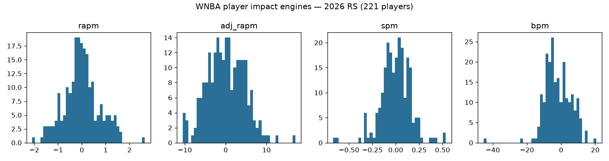
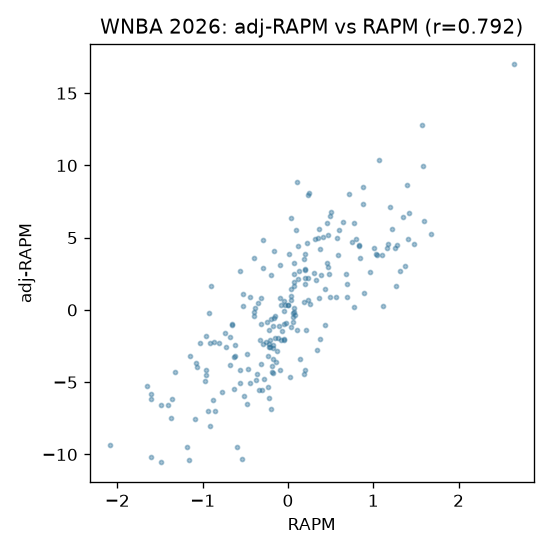
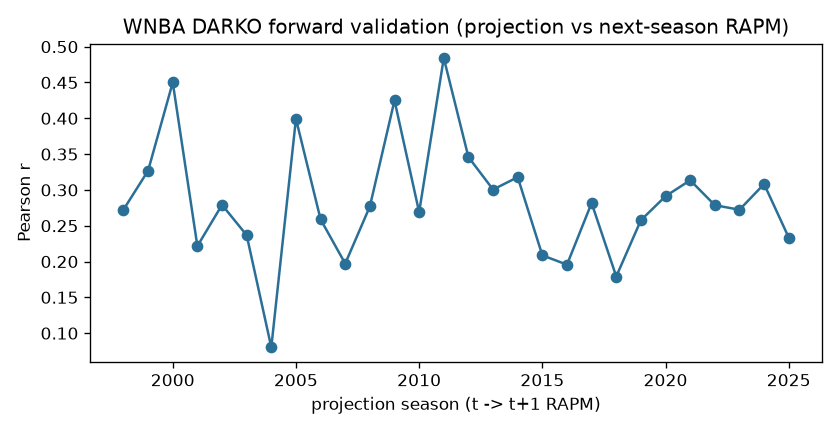

# WNBA player impact — model documentation

Consolidated per-season player-impact suite published to `wnba_player_impact`
(per-season parquet/csv/rds + a `wnba_player_impact_card.json` provenance
sidecar on every publish — the card is the per-run metadata authority).

## Engines (columns by family)

| engine | what it contributes |
|---|---|
| RAPM | possession on/off ridge (o_rapm / d_rapm / rapm) |
| adj-RAPM | RAPM with an SPM-derived prior (previous season's RS+PO blend) |
| SPM | box-score plus/minus, coefficients fit on RS RAPM targets |
| BPM 2.0 | box logs + listed positions |
| DARKO-style | cross-season Kalman filter + aging curve (projects next season) |
| WAR | RAPM rating x calibrated pts-per-win, replacement level -2.0 |

Substrates: the committed `wehoop`-stats raw store (possessions
compile + leaguegamelog / playerindex / leaguedashplayerbiostats captures) —
offline and clone-free via the URL store backend.

## Pipeline

Per-engine numbered stages `wnba_model_01_possessions` … `wnba_model_07_darko`
(parquet handoffs under `build_out/impact_engines/`; hermetic stub tests cover
the chain including cross-season prior threading) with the consolidated
build+publish as `wnba_model_08_impact`. Retrain is dispatch-only BY DESIGN
(rate-budgeted long build; `dry_run` defaults true). Pre-2005 team logs are repaired from player sums (see the 2026-07-28 publish notes); stats.wnba.com hangs on datacenter IPs, so multi-season builds run from a residential IP.

## Results / validation

Proxy-validated against the published RAPM/EPM oracle CSVs: the engines beat
the minutes-played baseline by ~10% on the proxy tasks; per-run diagnostics
live in the release card sidecar. Numeric publish-blocking floors are a
recorded TODO in `models/REGISTRY.md` (stated, not yet encoded).

## Evaluation on the published releases (2026-09-01)

Computed from the released `wnba_player_impact_{season}.parquet` assets (30 seasons, 1997-2026).

- adj-RAPM vs RAPM agreement (2026 RS): Pearson r = 0.792
- **DARKO forward validation** (projection in season t vs realized t+1 RAPM — out-of-sample by construction): weighted mean r = 0.284 over 28 season pairs

| projection season | n joined | Pearson r | MAE |
|---|---|---|---|
| 2016 -> 2017 | 110 | 0.196 | 1.78 |
| 2017 -> 2018 | 115 | 0.282 | 1.87 |
| 2018 -> 2019 | 115 | 0.179 | 1.46 |
| 2019 -> 2020 | 103 | 0.258 | 1.31 |
| 2020 -> 2021 | 110 | 0.291 | 1.54 |
| 2021 -> 2022 | 114 | 0.314 | 1.68 |
| 2022 -> 2023 | 116 | 0.279 | 1.32 |
| 2023 -> 2024 | 111 | 0.272 | 0.93 |
| 2024 -> 2025 | 120 | 0.308 | 1.70 |
| 2025 -> 2026 | 143 | 0.234 | 1.50 |

Card: [`wnba_player_impact_eval_card.json`](wnba_player_impact_eval_card.json)

## Figures

