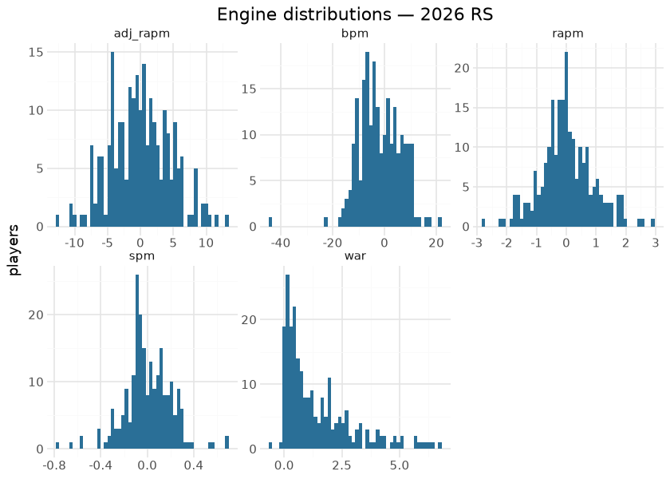
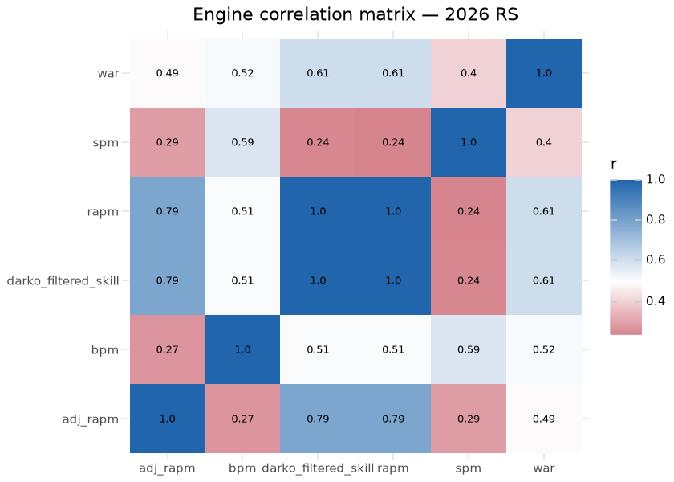
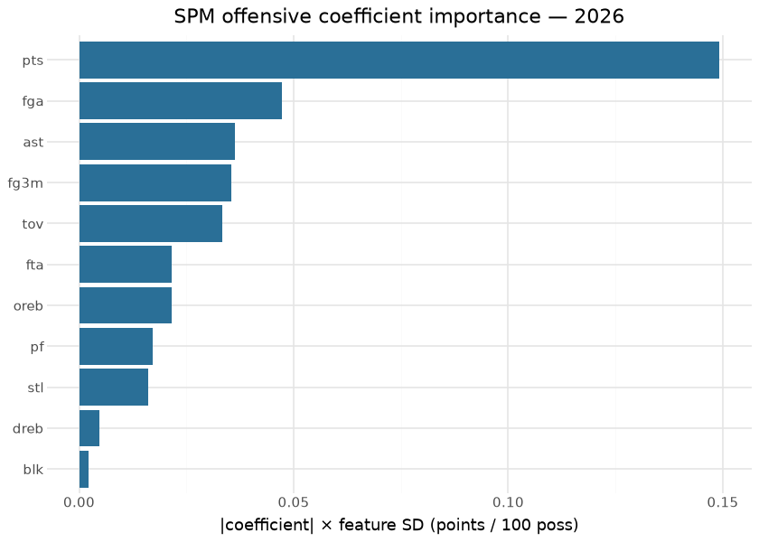
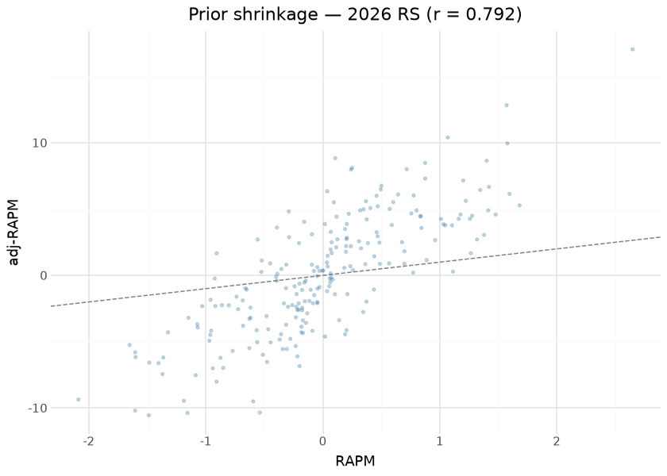
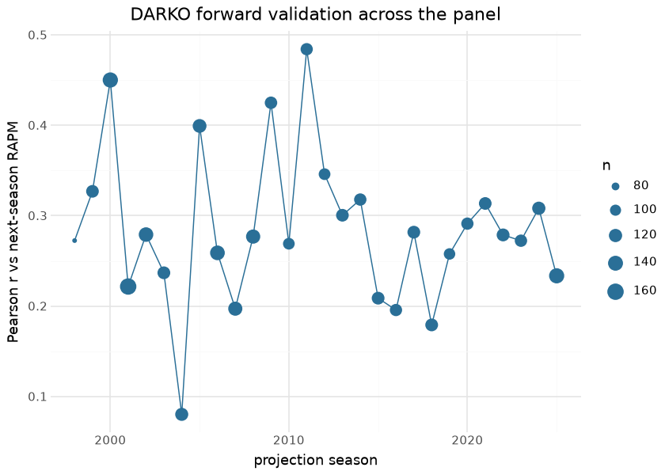

# WNBA player impact — the six-engine suite

The consolidated player-impact suite publishes one row per player-season
(regular season and playoffs) on the `wnba_player_impact` release tag,
with six engines’ columns side by side:

| engine | what it contributes |
|----|----|
| RAPM | possession on/off ridge (`o_rapm` / `d_rapm` / `rapm`) |
| adj-RAPM | RAPM with an SPM-derived prior (previous season’s RS+PO blend) |
| SPM | box-score plus/minus, coefficients fit on RS RAPM targets |
| BPM 2.0 | box logs + listed positions (`obpm` / `dbpm` / `bpm`) |
| DARKO-style | cross-season Kalman filter + aging curve (projects next season) |
| WAR | RAPM rating × calibrated pts-per-win, replacement level −2.0 |

Seasons build earliest-to-latest because two engines carry state
forward: SPM coefficients are fit ONCE per season on regular-season RAPM
(a ~15-game playoff sample would train noise on noise), and adj-RAPM’s
prior is the *previous* season’s possession-weighted RS+PO SPM blend — a
gap season deliberately breaks the prior chain. DARKO runs a per-season
Kalman step over the RAPM panel with an aging curve; playoff form enters
as a possession-weighted blend rather than a second time step, because a
second step would apply a season of aging twice.

The substrate is the committed `wehoop-wnba-stats-raw` store (per-game
playbyplay / rotation / boxscore payloads plus season-level captures),
read offline through the raw-store backend — `readonly` means OFFLINE: a
store miss raises rather than silently completing over the network, so a
build is reproducible or loudly incomplete, never quietly mixed. This
document, by contrast, evaluates the **published releases**: every
number and figure below is recomputed at render time from the release
assets themselves, which is exactly what a consumer downloads.

## Training data

| Published wnba_player_impact assets — last 12 of 30 seasons (1997–2026) |  |  |  |
|----|----|----|----|
| one row per player-season-seasontype; computed at render time from the release |  |  |  |
| season | player_rows | playoff_rows | off_possessions |
| 2015 | 245 | 86 | 170,665 |
| 2016 | 240 | 82 | 173,685 |
| 2017 | 242 | 85 | 171,960 |
| 2018 | 238 | 81 | 173,185 |
| 2019 | 243 | 87 | 172,585 |
| 2020 | 226 | 81 | 117,505 |
| 2021 | 235 | 81 | 165,495 |
| 2022 | 249 | 83 | 190,035 |
| 2023 | 235 | 79 | 206,750 |
| 2024 | 246 | 89 | 207,145 |
| 2025 | 272 | 91 | 242,005 |
| 2026 | 221 | 0 | 161,325 |

&#10;

## Exploratory data analysis

The correlation matrix is the suite’s honesty check: RAPM and adj-RAPM
agree strongly (the prior stabilizes, it does not overwrite), box
engines (SPM, BPM) form their own cluster, and DARKO’s filtered skill —
which sees every prior season — correlates with everything while
duplicating nothing.

## Attribution

The engines are linear models (ridge, regression, Kalman), so
attribution is native: each engine’s O/D split *is* its decomposition,
and the published columns carry it (`o_rapm`/`d_rapm`, `ospm`/`dspm`,
`obpm`/`dbpm`, `o_adj_rapm`/`d_adj_rapm`). No SHAP approximation is
needed — the columns are the exact attributions.

The SPM coefficient vector itself now ships as an additive sidecar,
`wnba_player_impact_spm_coefficients.json`: one record per season with
the offense and defense ridge coefficients, the feature names, the fit
population’s per-100 feature standard deviations, and the train-time fit
metrics. So this section shows the fitted model rather than describing
where it lives.

| Fitted SPM coefficients — 2026 (ridge, alpha = 100) |  |  |  |  |  |
|----|----|----|----|----|----|
| source: repo copy (wnba_player_impact_spm_coefficients.json); fit on 221 regular-season players, train r(spm, rapm) = 0.237 |  |  |  |  |  |
| feature | o_coef | d_coef | feature SD | \|o_coef\|×SD | \|d_coef\|×SD |
| pts | 0.018 | 0.001 | 8.224 | 0.149 | 0.005 |
| fga | −0.009 | −0.008 | 5.537 | 0.047 | 0.042 |
| ast | 0.012 | 0.004 | 3.085 | 0.036 | 0.013 |
| fg3m | 0.023 | 0.012 | 1.521 | 0.035 | 0.018 |
| tov | −0.020 | −0.012 | 1.700 | 0.033 | 0.020 |
| fta | −0.003 | 0.005 | 6.512 | 0.022 | 0.036 |
| oreb | 0.012 | 0.028 | 1.818 | 0.022 | 0.051 |
| pf | 0.005 | −0.015 | 3.746 | 0.017 | 0.057 |
| stl | 0.014 | 0.016 | 1.197 | 0.016 | 0.019 |
| dreb | 0.001 | 0.010 | 4.087 | 0.005 | 0.042 |
| blk | 0.002 | 0.018 | 1.293 | 0.002 | 0.024 |

&#10;

The sidecar is reproducible from the published data itself: refitting
each season on its released `o_rapm`/`d_rapm` target plus the same
committed box logs — through the same early-era team-log repair the
build applies, without which the pre-2005 per-100 features are garbage —
recovers the published `spm` column **exactly in all 30 seasons**
(maximum absolute difference 0.0). That check is stored per record as
`reproduces_published_spm_r`, so a refit that did *not* reproduce the
release would show up in the artifact instead of passing silently.

## Evaluation

**DARKO forward validation** is the suite’s headline out-of-sample test:
the projection made in season t (`darko_projected_rating`, which sees
nothing after t) against the realized RAPM in season t+1. Recomputed at
render time over every adjacent published season pair:

| DARKO forward validation — projection (t) vs realized RAPM (t+1) |  |  |  |
|----|----|----|----|
| out-of-sample by construction; weighted mean r = 0.284 over 28 season pairs |  |  |  |
| season | pearson | MAE | n |
| 2014 | 0.318 | 0.745 | 111 |
| 2015 | 0.209 | 1.318 | 115 |
| 2016 | 0.196 | 1.776 | 110 |
| 2017 | 0.282 | 1.870 | 115 |
| 2018 | 0.179 | 1.461 | 115 |
| 2019 | 0.258 | 1.314 | 103 |
| 2020 | 0.291 | 1.542 | 110 |
| 2021 | 0.314 | 1.677 | 114 |
| 2022 | 0.279 | 1.324 | 116 |
| 2023 | 0.272 | 0.929 | 111 |
| 2024 | 0.308 | 1.699 | 120 |
| 2025 | 0.233 | 1.495 | 143 |

&#10;

| Reliability context for the forward validation |  |  |
|----|----|----|
| the projection's ceiling is bounded by how noisy the RAPM target itself is |  |  |
| check | pearson | pairs |
| RAPM year-over-year reliability (same player, adjacent seasons) | 0.266 | 3379 |
| adj-RAPM vs RAPM agreement (2026 RS) | 0.792 | 221 |

&#10;

The forward-r is honest but modest, and the reliability row is why:
DARKO cannot correlate with next-season RAPM more than next-season RAPM
correlates with anything stable.

### Separating projection error from target noise

A single season of RAPM is a noisy realization of a player’s true level,
so a low forward correlation confounds *the projection being wrong* with
*the target being noisy*. Averaging the target over more post-projection
seasons (possession-weighted) reduces the target’s noise without
touching the projection. Restricting all three rows to the **same**
player-seasons keeps the comparison honest — a longer target window
would otherwise also change the population:

| DARKO against a multi-season blended target |  |  |  |  |  |  |
|----|----|----|----|----|----|----|
| same player-seasons in every row; only the target's noise changes |  |  |  |  |  |  |
| target | n | r (DARKO) | r (carry-forward RAPM) | MAE (DARKO) | MAE (carry-forward) | sd_target |
| next season only | 1883 | 0.259 | 0.270 | 1.447 | 1.486 | 1.550 |
| 2-season RAPM | 1883 | 0.269 | 0.277 | 1.327 | 1.369 | 1.299 |
| 3-season RAPM | 1883 | 0.287 | 0.296 | 1.253 | 1.301 | 1.153 |

&#10;

Two readings, both worth stating plainly:

- **Part of the “modest” forward-r is target noise, but less of it than
  in the NBA.** Holding the projection and the population fixed and only
  widening the target window lifts the correlation from ≈0.26 to ≈0.29
  (the NBA twin, measured the same way, moves ≈0.37 → ≈0.44). Averaging
  more WNBA seasons removes less noise because there are fewer
  possessions in each of them and because rosters turn over faster — so
  a WNBA player’s three-season blend is a blurrier picture of “the same
  player” than an NBA player’s is.
- **The projection is not beating simple persistence on rank.** Carrying
  season-*t* RAPM forward unchanged correlates with every target
  slightly better than the DARKO projection does. Where the projection
  earns its keep is **level**: its MAE is lower against every target,
  which is what shrinkage toward the aging-curve mean buys. Treat
  `darko_projected_rating` as a better-calibrated magnitude, not a
  better ordering — and the gap to persistence is the honest measure of
  what the Kalman step adds.

**The publish floors.** The five internal diagnostics above are now
frozen as **publish-blocking floors** in `models/REGISTRY.md` and
`wnba_model_publish/gates.py`, each set strictly below the value
observed on the 2026-07-29 release across all 30 published seasons; the
gate runs on every `impact` invocation and writes its report into the
card sidecar under `publish_gates`. The floors were **re-measured on
WNBA data rather than inherited from the NBA twin** — the forward ones
land at roughly half the NBA’s, because a ~40-game season leaves less
signal in each RAPM fit. The one gate family the twin has and this repo
does not is the oracle pair: no public WNBA player-impact metric
comparable to Ryan Davis RAPM or Dunks & Threes EPM is available here,
so instead of an always-skipped gate that could be mistaken for
coverage, concurrent validity is simply **not currently gated for the
WNBA** — the earlier claim that these engines were proxy-validated
against published oracle CSVs was inherited from the NBA writeup and did
not hold for this league.

## Results

| Top 15 by WAR — 2026 regular season (min 300 minutes) |  |  |  |  |  |  |  |  |
|----|----|----|----|----|----|----|----|----|
|  | Player | Team | GP | Min | RAPM | adj-RAPM | BPM | WAR |
|  | Olivia Miles | MIN | 26 | 801 | 1.68 | 5.28 | 14.10 | 3.83 |
|  | Courtney Williams | MIN | 28 | 862 | 1.48 | 4.59 | 9.41 | 3.81 |
|  | Kelsey Mitchell | IND | 27 | 871 | 1.41 | 4.90 | 8.27 | 3.79 |
|  | Kayla McBride | MIN | 28 | 908 | 1.26 | 1.67 | 11.46 | 3.76 |
|  | Kayla Thornton | GSV | 27 | 682 | 2.65 | 17.05 | 4.44 | 3.68 |
|  | Azzi Fudd | DAL | 26 | 823 | 1.35 | 6.44 | 4.37 | 3.42 |
|  | Jackie Young | LVA | 26 | 838 | 1.28 | 4.49 | 9.30 | 3.40 |
|  | Paige Bueckers | DAL | 25 | 839 | 1.20 | 7.15 | 9.51 | 3.32 |
|  | Chelsea Gray | LVA | 26 | 858 | 1.10 | 3.77 | 7.42 | 3.29 |
|  | Jessica Shepard | DAL | 27 | 899 | 0.89 | 1.16 | 9.79 | 3.22 |
|  | Natasha Howard | MIN | 28 | 831 | 1.11 | 0.28 | 11.79 | 3.19 |
|  | Nia Coffey | MIN | 28 | 733 | 1.32 | 2.71 | 11.24 | 3.07 |
|  | Breanna Stewart | NYL | 26 | 869 | 0.80 | 4.90 | 5.33 | 3.04 |
|  | A'ja Wilson | LVA | 24 | 762 | 1.18 | 4.59 | 11.90 | 2.97 |
|  | Veronica Burton | GSV | 27 | 763 | 1.05 | 3.79 | 12.00 | 2.79 |

&#10;

## Provenance & reproducibility

- **Trained on:** the committed `wehoop-wnba-stats-raw` store
  (possession compile from per-game playbyplay/rotation/boxscore +
  season-level leaguegamelog / playerindex / leaguedashplayerbiostats
  captures), seasons 1997–2026 (the corpus table above lists what the
  release carries), read offline through the raw-store backend.
- **Pipeline:** per-engine numbered stages `wnba_model_01_possessions` …
  `wnba_model_07_darko` (parquet handoffs under
  `build_out/impact_engines/`; hermetic stub tests cover the chain
  including cross-season prior threading), consolidated build+publish as
  `wnba_model_08_impact`. Retrain is dispatch-only BY DESIGN
  (rate-budgeted; `dry_run` defaults true); full-history backfills run
  from the droplet. Single home: `models/manifest.yaml`.
- **This document** evaluates the published `wnba_player_impact` release
  assets downloaded at render time — the exact frames consumers read.
- **Rebuild:** `scripts/render_model_docs.sh` (Quarto → GFM;
  `uv sync --group docs`). Requires network for the release download and
  the headshot CDN.

## Avenues for improvement & open issues

**Resolved (2026-09-01, PR \#WNBA_PR):**

- **Numeric publish floors are encoded** — five gates in
  `wnba_model_publish/gates.py`, each floor strictly below the value
  observed on the 2026-07-29 release across all 30 seasons, evaluated on
  every build and recorded in the card sidecar. The table (floor,
  observation, what it catches) lives in `models/REGISTRY.md`. Measured
  on WNBA data, not ported from the NBA twin.
- **The SPM coefficient vector ships** as the additive
  `wnba_player_impact_spm_coefficients.json` sidecar, and the
  Attribution section above shows real coefficient importance from it.
- **DARKO ceiling quantified** — the multi-season blended-target
  comparison separates projection error from target noise and states the
  projection’s standing against a carry-forward baseline.

Still open:

- **Uncertainty** — no engine ships an interval. The NBA twin’s
  prototype (cluster bootstrap by GAME, never by row) measured a median
  RAPM standard error *wider than the cross-sectional spread of RAPM
  itself* on a full 1,230-game season; a WNBA season is a third the
  size, so the same resample here should be expected to be wider still,
  and the prototype has not yet been run on this league’s possessions.
  Shipping it means B ≥ 200 replicates, an additive `rapm_se` column,
  and a floor on the interval’s own stability.
- **No public concurrent-validity oracle** for WNBA player impact. If
  one becomes available, the NBA twin’s oracle gate pair ports over
  directly.
- **PlayIn season type is unsupported** by design; revisit if the sample
  ever justifies it.
