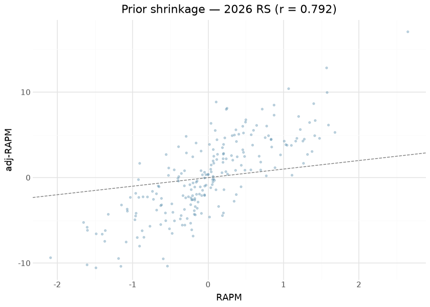

# WNBA player impact — the six-engine suite

The consolidated player-impact suite publishes one row per player-season
(regular season and playoffs) on the `wnba_player_impact` release tag,
with six engines’ columns side by side:

| engine | what it contributes |
|----|----|
| RAPM | possession on/off ridge (`o_rapm` / `d_rapm` / `rapm`) |
| adj-RAPM | RAPM with an SPM-derived prior (previous season’s RS+PO blend) |
| SPM | box-score plus/minus, coefficients fit on RS RAPM targets |
| BPM 2.0 | box logs + listed positions (`obpm` / `dbpm` / `bpm`) |
| DARKO-style | cross-season Kalman filter + aging curve (projects next season) |
| WAR | RAPM rating × calibrated pts-per-win, replacement level −2.0 |

Seasons build earliest-to-latest because two engines carry state
forward: SPM coefficients are fit ONCE per season on regular-season RAPM
(a ~15-game playoff sample would train noise on noise), and adj-RAPM’s
prior is the *previous* season’s possession-weighted RS+PO SPM blend — a
gap season deliberately breaks the prior chain. DARKO runs a per-season
Kalman step over the RAPM panel with an aging curve; playoff form enters
as a possession-weighted blend rather than a second time step, because a
second step would apply a season of aging twice.

The substrate is the committed `wehoop-wnba-stats-raw` store (per-game
playbyplay / rotation / boxscore payloads plus season-level captures),
read offline through the raw-store backend — `readonly` means OFFLINE: a
store miss raises rather than silently completing over the network, so a
build is reproducible or loudly incomplete, never quietly mixed. This
document, by contrast, evaluates the **published releases**: every
number and figure below is recomputed at render time from the release
assets themselves, which is exactly what a consumer downloads.

## Training data

| Published wnba_player_impact assets — last 12 of 30 seasons (1997–2026) |  |  |  |
|----|----|----|----|
| one row per player-season-seasontype; computed at render time from the release |  |  |  |
| season | player_rows | playoff_rows | off_possessions |
| 2015 | 245 | 86 | 170,665 |
| 2016 | 240 | 82 | 173,685 |
| 2017 | 242 | 85 | 171,960 |
| 2018 | 238 | 81 | 173,185 |
| 2019 | 243 | 87 | 172,585 |
| 2020 | 226 | 81 | 117,505 |
| 2021 | 235 | 81 | 165,495 |
| 2022 | 249 | 83 | 190,035 |
| 2023 | 235 | 79 | 206,750 |
| 2024 | 246 | 89 | 207,145 |
| 2025 | 272 | 91 | 242,005 |
| 2026 | 221 | 0 | 161,325 |

&#10;

## Exploratory data analysis

The correlation matrix is the suite’s honesty check: RAPM and adj-RAPM
agree strongly (the prior stabilizes, it does not overwrite), box
engines (SPM, BPM) form their own cluster, and DARKO’s filtered skill —
which sees every prior season — correlates with everything while
duplicating nothing.

## Attribution

The engines are linear models (ridge, regression, Kalman), so
attribution is native: each engine’s O/D split *is* its decomposition,
and the published columns carry it (`o_rapm`/`d_rapm`, `ospm`/`dspm`,
`obpm`/`dbpm`, `o_adj_rapm`/`d_adj_rapm`). No SHAP approximation is
needed — the columns are the exact attributions. What the release does
*not* carry is the SPM coefficient vector itself (it lives in the build
artifacts under `build_out/impact_engines/`), an omission recorded in
the avenues below.

## Evaluation

**DARKO forward validation** is the suite’s headline out-of-sample test:
the projection made in season t (`darko_projected_rating`, which sees
nothing after t) against the realized RAPM in season t+1. Recomputed at
render time over every adjacent published season pair:

| DARKO forward validation — projection (t) vs realized RAPM (t+1) |  |  |  |
|----|----|----|----|
| out-of-sample by construction; weighted mean r = 0.284 over 28 season pairs |  |  |  |
| season | pearson | MAE | n |
| 2014 | 0.318 | 0.745 | 111 |
| 2015 | 0.209 | 1.318 | 115 |
| 2016 | 0.196 | 1.776 | 110 |
| 2017 | 0.282 | 1.870 | 115 |
| 2018 | 0.179 | 1.461 | 115 |
| 2019 | 0.258 | 1.314 | 103 |
| 2020 | 0.291 | 1.542 | 110 |
| 2021 | 0.314 | 1.677 | 114 |
| 2022 | 0.279 | 1.324 | 116 |
| 2023 | 0.272 | 0.929 | 111 |
| 2024 | 0.308 | 1.699 | 120 |
| 2025 | 0.233 | 1.495 | 143 |

&#10;

| Reliability context for the forward validation |  |  |
|----|----|----|
| the projection's ceiling is bounded by how noisy the RAPM target itself is |  |  |
| check | pearson | pairs |
| RAPM year-over-year reliability (same player, adjacent seasons) | 0.266 | 3379 |
| adj-RAPM vs RAPM agreement (2026 RS) | 0.792 | 221 |

&#10;

The forward-r is honest but modest, and the reliability row is why:
DARKO cannot correlate with next-season RAPM more than next-season RAPM
correlates with anything stable. The engines were additionally
proxy-validated against the published oracle CSVs at build time (beating
the minutes-played baseline by ~10%); numeric publish-blocking floors
remain a recorded TODO in `models/REGISTRY.md`.

## Results

| Top 15 by WAR — 2026 regular season (min 300 minutes) |  |  |  |  |  |  |  |  |
|----|----|----|----|----|----|----|----|----|
|  | Player | Team | GP | Min | RAPM | adj-RAPM | BPM | WAR |
|  | Olivia Miles | MIN | 26 | 801 | 1.68 | 5.28 | 14.10 | 3.83 |
|  | Courtney Williams | MIN | 28 | 862 | 1.48 | 4.59 | 9.41 | 3.81 |
|  | Kelsey Mitchell | IND | 27 | 871 | 1.41 | 4.90 | 8.27 | 3.79 |
|  | Kayla McBride | MIN | 28 | 908 | 1.26 | 1.67 | 11.46 | 3.76 |
|  | Kayla Thornton | GSV | 27 | 682 | 2.65 | 17.05 | 4.44 | 3.68 |
|  | Azzi Fudd | DAL | 26 | 823 | 1.35 | 6.44 | 4.37 | 3.42 |
|  | Jackie Young | LVA | 26 | 838 | 1.28 | 4.49 | 9.30 | 3.40 |
|  | Paige Bueckers | DAL | 25 | 839 | 1.20 | 7.15 | 9.51 | 3.32 |
|  | Chelsea Gray | LVA | 26 | 858 | 1.10 | 3.77 | 7.42 | 3.29 |
|  | Jessica Shepard | DAL | 27 | 899 | 0.89 | 1.16 | 9.79 | 3.22 |
|  | Natasha Howard | MIN | 28 | 831 | 1.11 | 0.28 | 11.79 | 3.19 |
|  | Nia Coffey | MIN | 28 | 733 | 1.32 | 2.71 | 11.24 | 3.07 |
|  | Breanna Stewart | NYL | 26 | 869 | 0.80 | 4.90 | 5.33 | 3.04 |
|  | A'ja Wilson | LVA | 24 | 762 | 1.18 | 4.59 | 11.90 | 2.97 |
|  | Veronica Burton | GSV | 27 | 763 | 1.05 | 3.79 | 12.00 | 2.79 |

&#10;

## Provenance & reproducibility

- **Trained on:** the committed `wehoop-wnba-stats-raw` store
  (possession compile from per-game playbyplay/rotation/boxscore +
  season-level leaguegamelog / playerindex / leaguedashplayerbiostats
  captures), seasons 1997–2026 (the corpus table above lists what the
  release carries), read offline through the raw-store backend.
- **Pipeline:** per-engine numbered stages `wnba_model_01_possessions` …
  `wnba_model_07_darko` (parquet handoffs under
  `build_out/impact_engines/`; hermetic stub tests cover the chain
  including cross-season prior threading), consolidated build+publish as
  `wnba_model_08_impact`. Retrain is dispatch-only BY DESIGN
  (rate-budgeted; `dry_run` defaults true); full-history backfills run
  from the droplet. Single home: `models/manifest.yaml`.
- **This document** evaluates the published `wnba_player_impact` release
  assets downloaded at render time — the exact frames consumers read.
- **Rebuild:** `scripts/render_model_docs.sh` (Quarto → GFM;
  `uv sync --group docs`). Requires network for the release download and
  the headshot CDN.

## Avenues for improvement & open issues

- **Encode the numeric publish floors** — the registry states them as
  TODO; the proxy-validation deltas are exactly the values to freeze.
- **Publish the SPM coefficient vector** — the release carries the
  engine outputs but not the fitted coefficients; shipping them (or a
  per-retrain meta sidecar) would let this document show real
  coefficient importance instead of describing where it lives.
- **Uncertainty** — none of the engines ships an interval; a
  cluster-respecting resample (games, not rows) is the recorded
  standard.
- **DARKO ceiling** — the forward-r is capped by RAPM noise in the
  target; validating against a multi-season blended target would
  separate projection error from target noise.
- **PlayIn season type is unsupported** by design; revisit if the sample
  ever justifies it.
